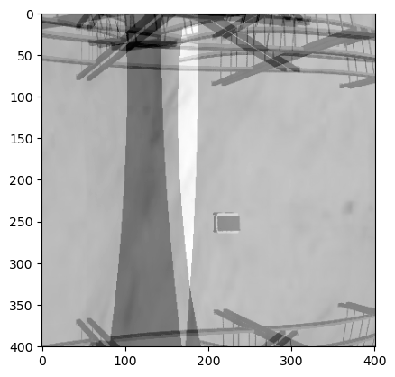

---

marp: true
theme: default
size: 4K
paginate: false
footer: 'Hamid Ebadi'
header: '[▣](#1 " ")    SIMLAN Project'
# SIMLAN opensource project

---

## Use MARP to see these slides

[https://marp.app/](https://marp.app/)

---

## Research Projects

- **SMILE-IV**: Developing enabling technologies and a safety assurance framework for transport services using small autonomous vehicles (Autonomous Mobile Robots, or AMRs): transport robots and delivery robots. The main objective of SMILE-IV is to transfer vehicular safety practices from SMILE I/II/III into the innovative transportation services provided by AMRs, with a particular focus on **autonomous transport robots in industrial environments** and delivery robots in public spaces.

- **ARTWORK**: The **smart** and **connected worker** project – aims to address the lack of IoT-based connectivity for industrial workers manually assembling complex products.

---

## Volvo GPSS Technology

In the factory of the future, humans and Autonomous Transport Robots (ATRs) will collaborate. \[...\] There are dynamic obstacles, such as **people** and traditional **forklifts**, which the system cannot control. \[...\] This is where GPSS (Generic Photogrammetry based Sensor System) technology plays a critical role. The concept is that **ceiling-mounted cameras** detect and classify all static and dynamic obstacles on the factory floor, guiding transport robots to their destinations without collisions or accidents. These cameras act as the **shared "eyes"** of the robot fleet.
([Source: Chalmers website](https://www.chalmers.se/en/current/news/e2-in-the-factory-of-the-future-humans-and-robots-work-together-on-equal-terms/))

[Watch on YouTube](https://www.youtube.com/watch?v=DA7lKiCdkCc)

---

## GPSS vs SLAM
[**SLAM**](https://en.wikipedia.org/wiki/Simultaneous_localization_and_mapping): constructing (or updating) a map of an unknown environment while simultaneously keeping track of an agent's location within it usually using  [Lidar](https://www.youtube.com/watch?v=ZAESH7bu3IY) or [Camera](https://youtu.be/9cPqbtiGWKM?feature=shared&t=16).

**GPSS**: No mapping but only localization using fixed cameras, simpler and cheaper robots, less autonomy but more centrally controlled and orchestrated, with no need for robot to robot communication. Effective in warehouses with uniform shelves and corridors or open space areas with no landmarks.

---

## SIMLAN: Features

**SIMLAN**, **S**imulation for **I**ndoor **M**ulti-Camera **L**ocalization and **N**avigation

- ROS2 (Humble)
- Gazebo Fortress
- Sensors:
  - Camera
  - Semantic segmentation
  - Depth sensors
  - Collision sensors

---

## SIMLAN: Open-Source Project

- **Static Elements**:

  - Boxes, pallets, shelves
  - Layouts
  - Camera coordination and orientation
  - ArUco markers on agents

- **Dynamic Elements**:

  - Pallet truck
  - Forklift
  - Worker model

---

## SIMLAN: Usecases

**Test:** to support test, verification and validation of complex, machine learning-based systems

- Cost-efficient
- Scalable
- Fast
- Safe
- Privacy-friendly
- Reproducible (unit tests for CI/CD)

**Train:** Algorithms such as **RL**  or **GA** algorithms need interaction with environment in the training phase. Also a quick method to compare different control systems.

---

## SIMLAN: GPSS Localization

- ArUco marker on agents
- `aruco_localization`: Robot localization and navigation using ArUco markers
- `camera_bird_eye_view`: Bird eye view by projecting camera images to be able to stitch them together

---

## SIMLAN:  GPSS Navigation

- `pallet_truck_navigation` : navigation using Nav2

---

## Future Work: Motion Capture

Simulating humanoid robots to replicate real worker movement for safety monitoring and ergonomic studies.

- Extracting 2D pose landmarks (MediaPipe)
- 2D → 3D ML models: pose landmarks to motions
- Replaying worker motion using MoveIt, ROS4HRI

---

## Future Work: Style Transfer with GANs

- Enhancing simulation realism through visual style transfer
- Developing **World Foundation Models (WFMs)** to advance physical AI
  - WFMs are neural networks that simulate real-world environments as video sequences and predict realistic outcomes based on text, image, or video input
  - World models understand real-world dynamics including physics and spatial properties

> Aims to reduce the gap between simulation and the real world

---

## Learn more

- [Infotiv portfolio of research projects](https://infotiv-research.github.io/)
- [SIMLAN github page](https://github.com/infotiv-research/SIMLAN)
