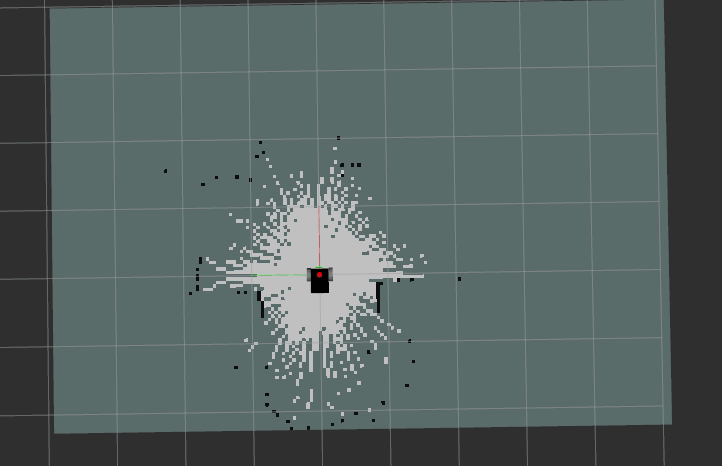
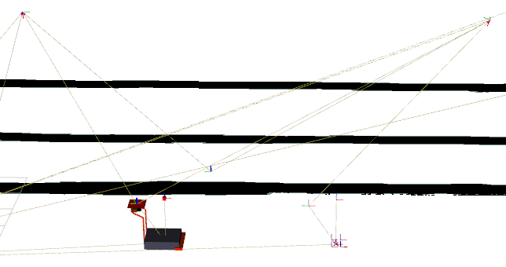
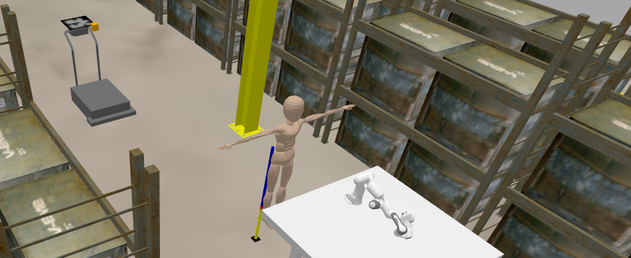

---

marp: true
theme: default
size: 4K
paginate: false
footer: 'Hamid Ebadi'
header: '[▣](#1 " ")    SIMLAN Project'
# SIMLAN opensource project

---

# SIMLAN, Simulation for Indoor Multi-Camera Localization and Navigation 

**Hamid Ebadi**

*Infotiv AB*

<!--
Use MARP to see these slides [https://marp.app/](https://marp.app/)
-->

---

# Research Projects

- **SMILE-IV**: Developing technologies and a **safety assurance framework** for transport services using small autonomous vehicles.

- **ARTWORK**: The **smart** and **connected worker** project, the goal is to create a real-time, context-aware assistance system for workers.
- Infotiv supports other partners with their research projects

---

# Volvo Projects

-  **RITA** (Robot In The Air) : a collaborative robot designed to assist with kitting in Volvo GTO in Gothenburg

-  **GPSS** (Generic Photogrammetry based Sensor System): **ceiling-mounted cameras** that detect and classify all static and dynamic obstacles on the factory floor, guiding transport robots to their destinations without collisions or accidents. These cameras act as the **shared "eyes"** of the robot fleet.

---

# Autonomous Robotics

- reliance on onboard sensors
- distributed decision making
- communication and synchronization

---

# Autonomous Robotics

## SLAM (Simultaneous localization and mapping)
- [SLAM](https://en.wikipedia.org/wiki/Simultaneous_localization_and_mapping): constructing (or updating) a map of an unknown environment while simultaneously keeping track of an agent's location within it usually using  [Lidar](https://www.youtube.com/watch?v=ZAESH7bu3IY) or [Camera](https://youtu.be/9cPqbtiGWKM?feature=shared&t=16).

---
# Autonomous Robotics (-)

- SLAM based
- limited field of view
- sensor interference (LiDAR)
- no global view
  - resolving right-of-way
  - avoiding gridlock
- handling challenging environments
  - absent, repetitive, or dynamic landmarks

---

[Watch on YouTube](https://www.youtube.com/watch?v=DA7lKiCdkCc) (read more: [Chalmers website](https://www.chalmers.se/en/current/news/e2-in-the-factory-of-the-future-humans-and-robots-work-together-on-equal-terms/))

---

---

# Centralised Robotics (+)

- GPSS (camera based)
- simpler onboard computation
- focus on control 
- energy consumption
- simpler hardware
- easier to maintain and upgrade
- no robot-to-robot communication

---

# Centralised Robotics (+)
- improved explainability and accountability
- camera is used for safety monitoring and repudiation.
- improving the safety by using both onboard and offboard sensors
- more flexible to add ML based models

---
# Centralised Robotics (-)

- no mapping but only localization using fixed cameras
- realtime needs and latency
- centralised processing and single point of failure

---

# SIMLAN

## **SIMLAN**, **SIM**ulation for **I**ndoor **M**ulti-Camera **L**ocalization **a**nd **N**avigation
- using simulation for complex human-robot industrial collaboration.
- inspired by Volvo Group’s GPSS
- models ceiling-mounted cameras + factory layouts

---

- OS:
  - mouse/screen compatible
  - editor/harddisk compatible
- ROS: Robot **Operating System**
  - camera/LiDAR
  - steering/wheel
  - robotic arm
- Gazebo: Simulator
  - physics
  - sensors

---

# SIMLAN: Asset & Environment Modeling (1)

- realistic blueprints & measurement-based warehouse models
- built using FreeCAD, Blender
- assets include shelves, pallets, cones, boxes, ...
- configurable physical properties:
  - collision, inertia, mass, dimensions, visuals

---
# SIMLAN: Asset & Environment Modeling (2)

- **Sensors**:
  - camera
  - semantic segmentation
  - depth sensors
  - collision sensors
- **Static Elements**:
  - boxes, pallets, shelves
  - layouts
  - camera coordination and orientation
  - ArUco markers on agents

---

[DEMO: SIMAN physics failures](https://youtu.be/wXyfRg-_eic)

---
# SIMLAN: Asset & Environment Modeling (3)

- **Dynamic Elements**:

  - pallet truck
  - forklift
  - worker

---

# Multi-Agent & Namespace Support & DOMAIN ID

- each agent has unique **namespace + ArUco ID**
- supports static & dynamic agent spawning
- isolated navigation stacks for each robot
- agents: pallet trucks, forklifts, jackal robots, human actors

---

# Camera

## Configuration/Calibration

- **Intrinsics**: focal lengths, principal point, distortion coeffs
- **Extrinsics**: rotation matrix + translation vector
- enables precise **world-to-pixel projection**
- crucial for image stitching & ArUco localization

---

# Bird’s-Eye View & Image stitching

- transform world → camera → pixel coordinates
- enables stitching of multiple camera feeds
- `camera_bird_eye_view` package

---

# ArUco Localization

- proof-of-concept GPSS system in SIMLAN
- uses OpenCV ArUco markers for localization
- multi-camera robustness
- `aruco_localization` package

---

---

# ArUco Navigation

- Input: `tf2` (positions)
- `Nav2` navigates (with a lot of wiring)

---

# Safety

integrated ROS2 "Behavior Tree" for Geo-fencing and immediate truck stop upon safety triggers 
 - loss of observability
 - restricted area
 - collision

---

[SIMAN GPSS video demo](https://youtu.be/mhA51PPdABc?si=aGnCkyvzAF7rpz8v&t=108)

---
# Gazebo Actors

- Gazebo's actor supports advanced visual features like skeleton animation from COLLADA or BVH files and scripted trajectories 
- Gazebo actors are static (scripted trajectories only) and cannot interact physically.
- limiting their behavior to what they are strictly scripted for

---

# Humanoid Worker Modeling

Simulating humanoid robots to replicate real worker movement for safety monitoring and study its interaction with other agents.

- Google Mediapipe landmarks (human pose estimation).
- custom Neural Network translates landmarks to joint controls.
- MoveIt2 handles motion planning and execution of the humanoid in Gazebo.

---

[Humanoid training](https://www.youtube.com/watch?v=iNW2jYUsv9c)

---

[Panda arm demo](https://www.youtube.com/watch?v=3yCLIu5GAn8)
[Panda arm and humanoid demo](https://www.youtube.com/watch?v=EiCNiPeifPk)

---

# Summary of SIMLAN Features

- lower barriers for research in robotics/ML
- dockerized dev environment
- features:
  - bird’s-eye stitching
  - ArUco-based localization
  - ROS 2 / Nav2 integration
  - Panda arm and humanoid

---
# SIMLAN Use Cases

- **rapid prototyping** of ML-based localization/navigation
- **reproducible experiments** : consistent testing
- **synthetic data generation** for ML models
- **safety testing** without risking physical assets
- **high level of interaction** reinforcement learning & genetic algorithm experimentation
- **CI/CD** : continuous development
- **V&V** to support verification and validation of complex, machine learning-based systems

---

# SIMLAN Use Cases

- cost-efficient
- scalable
- fast
- safe
- privacy-friendly
- reproducible (unit tests for CI/CD)

---

# Open source

- SIMLAN : [https://github.com/infotiv-research/SIMLAN](https://github.com/infotiv-research/SIMLAN)

- Infotiv portfolio of projects (academic papers) : [https://infotiv-research.github.io/](https://infotiv-research.github.io/)

---

# Future Work : Reinforcement Learning

### Google Deepmind 
Reward for actions

---

# Future Work :  Machine Learning

---

# Future Work : Classic AI

---

# Future Work : Generative AI (upscaling)

---

# Future Work : Generative AI
- output is not known
- low dimension to high dimension
- hallucination

Examples:
- text -> image
- blurry image -> sharp image
- text -> more text (LLMs)

---

# Future Work : WFM

- distribute computation across nodes
- move from ArUco markers : markerless vision pipelines
- integrate **World Foundation Models** (e.g., NVIDIA Cosmos)
- style transfer w/ GANs : higher visual fidelity
- human-robot interaction simulation

[Demo 1](https://github.com/user-attachments/assets/4c1da01f-c3fd-4b6c-b084-f5ef653abb80) , [Demo 2](https://github.com/user-attachments/assets/169cf5c5-de59-44db-b1bf-19fb57cb7e2e)

---

# Conclusion

- **SIMLAN**: powerful platform for indoor multi-camera robotics
- reproducible, scalable, open-source
- useful for academia & industry
- roadmap: ML integration, human-robot collaboration, sim-to-real transfer
- need your support

---

# Technical Highlights

- **simulation Engine**: Ignition Gazebo (High-fidelity physics and sensor models)
- **middleware**: ROS 2 (Jazzy Jalisco) for component communication
- **developer environment**: Docker + VSCode devcontainers (consistency and reproducibility)
- **documentation**: extensive & reproducible

---
## Acknowledgements

 - SMILE IV (Vinnova grant 2023-00789)
 - EUREKA ITEA4 ArtWork (Vinnova grant 2023-00970)

- **infotiv Colleagues**:  Pär Aronsson, Anton Hill, David Espedalen, Siyu Yi,  Anders Bäckelie, Jacob Rohdin, Vasiliki Kostara, Nazeeh Alhosary
- **Other contributors** Tove Casparsson , Filip Melberg (Chalmers), Christoffer Johannesson, Sebastian Olsson, Hjalmar Ruscck from Dyno-robotics,  Erik Brorsson (Chalmers/Volvo), **<place holder for your name>**
- thanks to: Infotiv AB, RISE, Volvo Group, Dyno-Robotics, Chalmers

---

INFOTIV AB | Dyno-robotics | RISE Research Institutes of Sweden | CHALMERS | Volvo Group 
------------ |  ------------  | ------------ | ------------ | ------------
  |   |   |  | 

---

- [https://infotiv-research.github.io/](https://infotiv-research.github.io/)
- [https://github.com/infotiv-research/SIMLAN](https://github.com/infotiv-research/SIMLAN)
