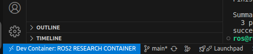
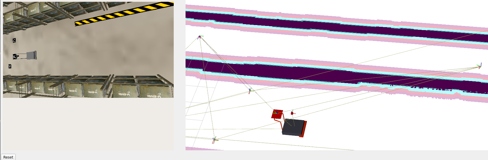
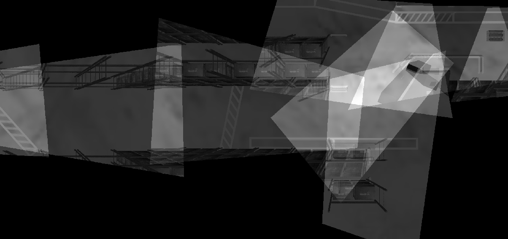
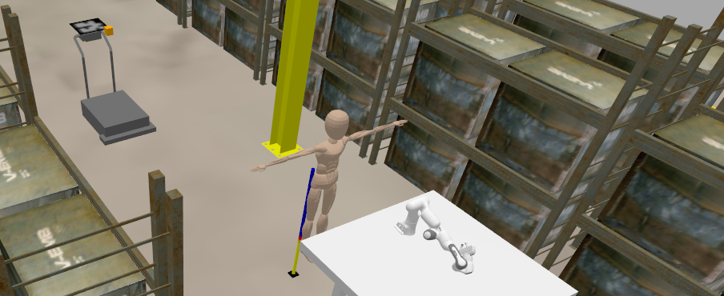
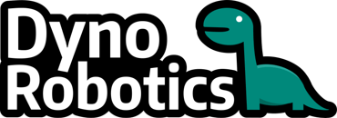

# SIMLAN, Simulation for Multi-Camera Robotics (5.1.4)

This simulation environment, based on the Ignition Gazebo simulator and ROS 2, resembles a Volvo Trucks warehouse and serves as a playground for rapid prototyping and testing of systems that rely on a multi-camera setup for perception, monitoring, localization or even navigation. This project is inspired by [GPSS (Generic photo-based sensor system)](https://www.volvogroup.com/en/news-and-media/news/2024/nov/ai-modern-manufacturing.html) that utilizes ceiling-mounted cameras, deep learning and computer vision algorithms, and very simple transport robots.
\[[📹 GPSS demo](https://www.youtube.com/watch?v=DA7lKiCdkCc)\]

- 🔗 [Online Documentation](https://infotiv-research.github.io/SIMLAN/)
- 📃 [PDF Documentation](https://infotiv-research.github.io/SIMLAN/SIMLAN.pdf)

## SIMLAN Features

- Ignition Gazebo
- Library of assets
- Real-World environment inspired design (camera position and warehouse layout)
- ROS 2 interfaces (Humble and Jazzy)
- Simple GPSS (Generic Photo-based Sensor System) navigation
- Multi-Robot localization and navigation using Nav2
- ArUco marker localization
- Bird's-Eye view projection
- Multi-Sensor Support (LiDAR, RGB camera, semantic segmentation, depth, etc.)
- Geofencing for safe zones and safe stop on collision
- Humanoid worker model
- Panda arm robotic arm
- Deep-learning-based human pose capture and replay,

📹 Click the YouTube link below to view the SIMLAN demo video:

[](https://www.youtube.com/watch?v=FJcsVDP3DHg)

## Installation \[[📹 Demo](https://www.youtube.com/watch?v=DgJXlsXUa-w)\]

### Dependencies

**Ubuntu 24.04:** use the instructions in [dependencies.md#linux-dependencies](dependencies.md#linux-dependencies) to install Docker and ensure that your Linux user account has `docker` access.
*Attention*: Make sure to restart the computer (for the changes in group membership to take effect) before proceeding to the next step.

**Windows 11:** use the instructions in [dependencies.md#windows-dependencies](dependencies.md#windows-dependencies) to install dependencies.

**Production environment**: follow installation procedure used in [.devcontainer/Dockerfile](.devcontainer/Dockerfile) to install dependencies.

**Development environment**: To improve collaboration we use VS Code and Docker as explained in [this instruction](https://www.allisonthackston.com/articles/docker-development.html) and [docker files](https://github.com/athackst/dockerfiles).
Install Visual Studio Code (VS Code) and open the project folder. VS Code will prompt you to install the required extension dependencies.
Make sure the `Dev containers` extension is installed. Reopen the project in VS Code, and you will be prompted to rebuild the container. Accept the prompt; this process may take a few minutes.
Once VS Code is connected to Docker (as shown in the image below), open the terminal and run the following commands:



(if you don't see this try to build manually in VS Code by pressing `Ctrl + Shift + P` and select `Dev Containers: Rebuild and Reopen in Container`.)

### Quick Start

The best place to learn about the various features, start different components, and understand the project structure is [`./control.sh`](./control.sh).

*Attention*: The following commands (using `./control.sh`) are executed in a separate terminal tab inside VS Code.

To kill all the relevant processes (related to Gazebo and ROS 2), delete build files, delete recorded images and rosbag files using the following command:

```bash
./control.sh clean
```

To clean up and build the project:

```bash
./control.sh build
```

(optionally, in VS Code you can click on Terminal-> Run Task/Run Build Task or use `Ctrl + Shift + B`)

## GPSS controls (pallet trucks, aruco) \[[📹 Demo](https://www.youtube.com/watch?v=_UhRFR-L9iQ)\]

It is possible for the cameras to detect ArUco markers on the floor and publish their location to TF, both relative to the camera, and the ArUcos transform from origin. The package [./camera_utility/aruco_localization](./camera_utility/aruco_localization) contains the code for handling ArUco detection.

You can also use Nav2 to make a robot_agent (that can be either robot/pallet_truck) navigate by itself to a goal position. You can find the code in [simulation/pallet_truck/pallet_truck_navigation](simulation/pallet_truck/pallet_truck_navigation)

**Run these three in separate terminals**

```bash
./control.sh gpss # spawn the simulation, robot_agents and GPSS ArUco detection
./control.sh nav ROBOTS  # spawn map server, and separate nav2 stack in a separate namespace for each robot_agent
./control.sh send_goal robot_agent_1 2.0 1.0 # send navigation goal x=2.0 y=1.0 to nav2 stack for robot_agent_1
```



`camera_enabled_ids` in [`config.sh`](config.sh) specifies which cameras are enabled in the GPSS system for ArUco code detection and bird's-eye view.
% HAMID_NOTE: I think this needs some clarification on how to get the image from birdeye in rviz and also maybe add what needs to be running for birdeye to work.

```bash
./control.sh birdeye
```



## RITA controls (humanoid, robotic arm) \[[📹 Demo](https://www.youtube.com/watch?v=EiCNiPeifPk)\]

To spawn a human worker run the following command

```bash
./control.sh sim
./control.sh humanoid
```

We employ a deep neural network to learn the mapping between human pose and humanoid robot motion. The model takes 33 MediaPipe pose landmarks as input and predicts corresponding robot joint positions. Read more about it [Humanoid Utilities](humanoid_utility/README.md)

#### Arm controls

Spawn the Panda arm inside SIMLAN and instruct it to pick and place a box around with the following commands:

```
./control sim
./control panda
./control plan_panda_motion
```



## Testing

Integration tests can be found inside of the [integration_tests/test/](./integration_tests/test/) package. Running the tests helps maintain the project's quality. For more information about how the tests are set up, check out the package [README](./integration_tests/README.md). To run all tests, run the following command:

```
./control.sh build
./control.sh test
```

## Customized startup

In `config.sh` it is possible to customize your scenarios. From there you can edit what world you want to run, how many cameras you want enabled, and also edit Humanoid-related properties. Modifying these variables is preferred, rather than modifying the `control.sh` file.

### Headless gazebo

In `config.sh` there is a variable `headless_gazebo` that you can set to "true" or "false". Setting it to true means will run without a window though the simulation will still run as normal. This can be useful when visualization is redundant. Setting it to false means the gazebo window will be visible.

### World fidelity

in the `config.sh` script, you can adjust the world fidelity

- `default`: Contains the default world with maximum objects
- `medium`: Based on default but boxes are removed
- `light`: Based on medium but shelves are removed
- `empty`: Everything except the ground is removed

### Older versions

- [`gz_classic_humble`](https://github.com/infotiv-research/SIMLAN/tree/gz_classic_humble) branch contains code for  **Gazebo Classic (Gazebo11)** that has reached end-of-life (EOL).
- [`ign_humble`](https://github.com/infotiv-research/SIMLAN/tree/ign_humble) branch contains code for  **ROS 2 Humble & Ignition Gazebo**, an earlier version of this repository.

## Documentation

You can build the online documentation page or a PDF file by running scripts in [`resources/build-documentation`](resources/build-documentation/).

- [`control.sh` script](control.sh) is  a shortcut to run different launch scripts, please also see [these diagram](resources/diagrams/).
- [`config.sh`](config.sh) contains information about which world is loaded, which cameras are active, and what and where the robots are spawned.
- [Marp Markdown Presentation](presentation.md)
- [Configuration Generation](config_generation/README.md)
- [Bringup and launch files](resources/diagrams/launch_bringup.drawio.png)
- [Pallet Truck Navigation Documentation](simulation/pallet_truck/pallet_truck_navigation/README.md)
- [Camera Utilities and notebooks](camera_utility/):  ([Extrinsic/Intrinsic calibrations](camera_utility/camera_calib.ipynb) and [Projection](camera_utility/projection.ipynb) )
- [Humanoid Utilities (pose2motion)](humanoid_utility/README.md)
- [`CHANGELOG.md`](CHANGELOG.md)
- [`credits.md`](credits.md)
- [`LICENSE` (apache 2)](LICENSE)
- [`contributing.md`](contributing.md)
- [`ISSUES.md`](ISSUES.md) : known issues and advanced features
- [`simulation/`](simulation/): ROS2 packages
  - [Simulation and Warehouse Specification (fidelity)](simulation/README.md)
  - [Camera and Birdeye Configuration](simulation/camera_bird_eye_view/README.md)
  - [Building Gazebo models (Blender/Phobos)](simulation/raw_models/README.md)
  - [Objects Specifications](simulation/raw_models/objects/README.md)
  - [Warehouse Specification](simulation/raw_models/warehouse/README.md)
  - [Pallet truck bringup](simulation/pallet_truck/pallet_truck_bringup/README.md)
  - [Aruco Localization Documentation](simulation/aruco_localization/README.md)
  - [Geofencing and Collision safe stop](simulation/bt_failsafe/README.md)
  - [Visualize Real Data](simulation/visualize_real_data/README.md) **requires data from Volvo**
  - [Humanoid bringup](simulation/humanoid_robot/README.md)
  - [humanoid_robot simulation](simulation/humanoid_robot/)
  - [Humanoid Control](simulation/humanoid_support_moveit_config/README.md)

## Research Funding

This work was carried out within these research projects:

- The [SMILE IV](https://www.vinnova.se/p/smile-iv/) project financed by Vinnova, FFI, Fordonsstrategisk forskning och innovation under the grant number 2023-00789.
- The EUREKA ITEA4 [ArtWork](https://www.vinnova.se/p/artwork---the-smart-and-connected-worker/) - The smart and connected worker financed by Vinnova under the grant number 2023-00970.

| INFOTIV AB                            | Dyno-robotics                          | RISE Research Institutes of Sweden | CHALMERS                               | Volvo Group                    |
| ------------------------------------- | -------------------------------------- | ---------------------------------- | -------------------------------------- | ------------------------------ |
|  |  |  |  |  |

[SIMLAN](https://github.com/infotiv-research/SIMLAN) project was started and is currently maintained by [Hamid Ebadi](https://github.com/ebadi). To see a complete list of contributors see the [changelog](CHANGELOG.md).
