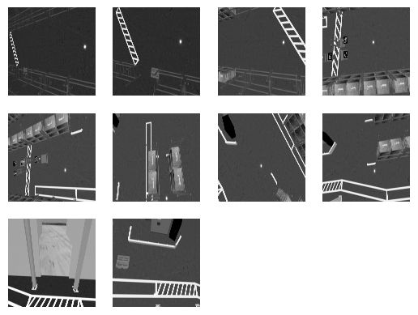

# SIMLAN, Simulation for Multi-Camera Robotics (4.0.1)

This simulation environment, based on the Ignition Gazebo simulator and ROS 2, resembles a Volvo Trucks warehouse and serves as a playground for rapid prototyping and testing of systems that rely on a multi-camera setup for perception, monitoring, localization or even navigation. This project is inspired by [GPSS (Generic photo-based sensor system)](https://www.volvogroup.com/en/news-and-media/news/2024/nov/ai-modern-manufacturing.html) that utilizes ceiling-mounted cameras, deep learning and computer vision algorithms, and very simple transport robots.
\[[📹 GPSS demo](https://www.youtube.com/watch?v=DA7lKiCdkCc)\]

- 🔗 [Online Documentation](https://infotiv-research.github.io/SIMLAN/)
- 📃 [PDF Documentation](SIMLAN.pdf)

## SIMLAN Features

- Ignition Gazebo
- Library of assets
- Real-World environment inspired design (camera position and warehouse layout)
- ROS 2 interfaces (Humble and Jazzy)
- ArUco marker localization
- Simple GPSS (Generic Photo-based Sensor System) navigation
- Multi-Robot localization and navigation using Nav2
- Bird's-Eye view projection
- Multi-Sensor Support (LiDAR, RGB camera, semantic segmentation, depth, etc.)
- Geofencing for safe zones and safe stop on collision
- Motion capture for Human-Robot Collaboration/Interaction (HRC/HRI)

📹 Click the YouTube link below to view the SIMLAN demo video:

[](https://www.youtube.com/watch?v=FJcsVDP3DHg)

## Installation \[[📹 Demo](https://www.youtube.com/watch?v=DgJXlsXUa-w)\]

### Dependencies

**Ubuntu 24.04:** use the instructions in [dependencies.md#linux-dependencies](dependencies.md#linux-dependencies) to install Docker and ensure that your Linux user account has `docker` access.
*Attention*: Make sure to restart the computer (for the changes in group membership to take effect) before proceeding to the next step.

**Windows 11:** use the instructions in [dependencies.md#windows-dependencies](dependencies.md#windows-dependencies) to install dependencies.

**Production environment**: follow installation procedure used in [.devcontainer/Dockerfile](.devcontainer/Dockerfile) to install dependencies.

**Development environment**: To improve collaboration we use VS Code and Docker as explained in [this instruction](https://www.allisonthackston.com/articles/docker-development.html) and [docker files](https://github.com/athackst/dockerfiles).
Install Visual Studio Code (VS Code) and open the project folder. VS Code will prompt you to install the required extension dependencies.
Make sure the `Dev containers` extension is installed. Reopen the project in VS Code, and you will be prompted to rebuild the container. Accept the prompt; this process may take a few minutes.
Once VS Code is connected to Docker (as shown in the image below), open the terminal and run the following commands:


(if you don't see this try to build manually in VS Code by pressing `Ctrl + Shift + P` and select `Dev Containers: Rebuild and Reopen in Container`.)

### Quick Start

The best place to learn about the various features, start different components, and understand the project structure is [`./control.sh`](./control.sh).

*Attention*: The following commands (using `./control.sh`) are executed in a separate terminal tab inside VS Code.

To kill all the relevant processes (related to Gazebo and ROS 2), delete build files, delete recorded images and rosbag files using the following command:

```bash
./control.sh clean
```

To clean up and build the ROS 2 simulation

```bash
./control.sh build
```

(optionally, in VS Code you can click on Terminal-> Run Task/Run Build Task or use `Ctrl + Shift + B`)

## GPSS controls (pallet trucks, aruco) \[[📹 Demo](https://www.youtube.com/watch?v=_UhRFR-L9iQ)\]

It is possible for the cameras to detect ArUco markers on the floor and publish their location to TF, both relative to the camera, and the ArUcos transform from origin. The package [./camera_utility/aruco_localization](./camera_utility/aruco_localization) contains the code for handling ArUco detection.

You can also use Nav2 to make a robot_agent (that can be either robot/pallet_truck) navigate by itself to a goal position. You can find the code in [simulation/pallet_truck/pallet_truck_navigation](simulation/pallet_truck/pallet_truck_navigation)

**Run these three in separate terminals**

```bash
./control.sh gpss # spawn the simulation, robot_agents and GPSS ArUco detection
./control.sh nav  # spawn map server, and separate nav2 stack in a separate namespace for each robot_agent
./control.sh send_goal # send navigation goals to nav2 stack for each robot_agent
```

If you want to control any robot (pallet truck, humanoid, etc.) manually you can run the following command. Remember to specify what robot you want to control by adding its namespace as argument, i.e. `./control.sh teleop pallet_truck_1`

```bash
./control.sh teleop ${YOUR_ROBOT_NAMESPACE}
```

If you want to record any of your topics during the tests you can run the following command. Change the topic in the control.sh script: `ros2 bag record /topic` to whatever topic you want to record.

```bash
./control.sh ros_record
```

To replay your latest recorded rosbag run the following command:

```bash
./control.sh ros_replay
```

If you want to do a camera dump and save the image from each camera as a .png run the following command. The images will appear at `/src/camera_utility/camera_number`.

```bash
./control.sh camera_dump
```



If you want to take a screenshot of one of the camera views, run the following command. Replace `###` with the camera you want to take a screenshot of. (163, 164, 165 or 166)

```bash
./control.sh screenshot ###
```

```bash
./control.sh birdeye
```


If you want to add the TF links between the cameras and the ArUco markers without running the `gpss` command, you can run the following command. This is primarily useful for debugging, as `gpss` runs this as well.

```bash
./control.sh aruco_detection
```

Finally, to view the bird's-eye perspective from each camera, run the following command and open `rviz`. Then, navigate to the left panel and under "Camera" change the Topic `/static_agents/camera_XXX/image_projected` to visualize the corresponding camera feed:


## RITA controls (humanoid, robotic arm) \[[📹 Demo](https://www.youtube.com/watch?v=EiCNiPeifPk)\]

```bash
./control.sh humanoid
```

To move the humanoid around in the simulator

```bash
./control.sh teleop ${YOUR_HUMANOID_NAMESPACE}
```


#### Arm controls

Spawn the Panda arm inside SIMLAN and instruct it to pick and place a box around with the following commands:

```
./control panda
./control plan_motion
./control pick
```

## Testing

Integration tests can be found inside of the [integration_tests/test/](./integration_tests/test/) package. Running the tests helps maintain the project's quality. For more information about how the tests are set up, check out the package [README](./integration_tests/README.md). To run all tests, run the following command:

```
./control.sh test
```

## Scenarios

In [scenarios.sh](scenarios.sh) you can run predefined scenarios of the project. At the bottom of the file, commands are shown how to run it; otherwise each scenario is referenced by a number.
Currently there are 3 scenarios and to run them, run this command in the shell

Before running scenario 1 that uses GPSS cameras, make sure that `CAMERA_ENABLED_IDS` in `config.sh` has the list of GPSS cameras.

```
./control.sh build
./scenarios.sh 1 # navigation using GPSS cameras (real time factor need to be updated)
./scenarios.sh 2 # Humanoid and robotic arm
./scenarios.sh 3 # Humanoid navigation without GPSS cameras (navigate_w_replanning_and_recovery_robot_agent_X.xml need to be updated )
./scenarios.sh 4 # Record the video demo
```

If you want to see the planning route for all agents, load `scenario_3_planning.rviz` in Rviz.

Keep in mind to change `real_time_factor` in [`simulation/simlan_gazebo_environment/worlds/ign_simlan_factory.world.xacro`](/simulation/simlan_gazebo_environment/worlds/ign_simlan_factory.world.xacro) to small values to slow down the simulator (e.g. 0.05-0.1) before building the project. `./control.sh build`

## Advanced options

See [resources/ISSUES.md](resources/ISSUES.md) to learn about additional advanced options and to check known issues before reporting any issue or requesting new features. To start the project **without NVIDIA GPU**, please comment out these lines in `docker-compose.yaml` as shown below:

```bash
  #   runtime: nvidia
  #
  # factory_simulation_nvidia:
  #  <<: *research-base
  #  container_name: factory_simulation_nvidia
  #  runtime: nvidia
  #  deploy:
  #    resources:
  #      reservations:
  #        devices:
  #          - driver: nvidia
  #            count: "all"
  #            capabilities: [compute,utility,graphics,display]
```

`camera_enabled_ids` specifies which cameras are enabled in the scene for ArUco code detection and bird's-eye view.

### Customized startup

In `config.sh` it is possible to customize your scenarios. From there you can edit what world you want to run, how many cameras you want enabled, and also edit Humanoid-related properties. Modifying these variables is preferred, rather than modifying the `control.sh` file.

### World fidelity

in the `config.sh` script, you can adjust the world fidelity

The active worlds are:

| arguments | configuration                                   |
| --------- | ----------------------------------------------- |
| `default` | Contains the default world with maximum objects |
| `medium`  | Based on default but boxes are removed          |
| `light`   | Based on medium but shelves are removed         |
| `empty`   | Everything except the ground is removed         |

### Filtering log output

In `config.sh` you can set the level of logs you want outputted into the terminal. By default it is set to "info" to allow all logs. Possible values are: "debug", "info", "warn", and "error". Setting it to "warn" filters out all debug and info messages. Additionally, to filter out specific lines you can add the phrase you want filtered inside `log_blacklist.txt` and setting the `log_level` flag to "warn" or "error" will start filtering out all phrases found in the blacklist.

### Older versions

- [`gz_classic_humble`](https://github.com/infotiv-research/SIMLAN/tree/gz_classic_humble) branch contains code for  **Gazebo Classic (Gazebo11)** that has reached end-of-life (EOL).
- [`ign_humble`](https://github.com/infotiv-research/SIMLAN/tree/ign_humble) branch contains code for  **ROS 2 Humble & Ignition Gazebo**, an earlier version of this repository.

## Documentation

Learn about the project by reading 📃 [online documentation page](https://infotiv-research.github.io/SIMLAN)

You can build the online documentation page or a PDF file by running scripts in [`resources/build-documentation`](resources/build-documentation/).

- [`control.sh` script](control.sh) is  a shortcut to run different launch scripts, please also see [these diagram](resources/diagrams/).

- [`config.sh`](config.sh) contains information about which world is loaded, which cameras are active, and what and where the robots are spawned.

- [Marp Markdown Presentation](presentation.md)

- [Configuration Generation](config_generation/README.md)

- [Bringup and launch files](resources/diagrams/launch_bringup.drawio.png)

- [Pallet Truck Navigation Documentation](simulation/pallet_truck/pallet_truck_navigation/README.md)

- [Camera Utilities and notebooks](camera_utility/):  ([Extrinsic/Intrinsic calibrations](camera_utility/camera_calib.ipynb) and [Projection](camera_utility/projection.ipynb) )

- [Humanoid Utilities (pose2motion)](humanoid_utility/README.md)

- [`simulation/`](simulation/): ROS2 packages

  - [Simulation and Warehouse Specification (fidelity)](simulation/README.md)
  - [Building Gazebo models (Blender/Phobos)](simulation/raw_models/README.md)
  - [Objects Specifications](simulation/raw_models/objects/README.md)
  - [Warehouse Specification](simulation/raw_models/warehouse/README.md)
  - [Aruco Localization Documentation](simulation/aruco_localization/README.md)
  - [humanoid_robot Simulation](simulation/humanoid_robot/)
  - [Geofencing and Collision safe stop](simulation/bt_failsafe/README.md)
  - [Visualize Real Data](simulation/visualize_real_data/README.md) **requires data from Volvo**
  - [Humanoid Control](simulation/humanoid_support_moveit_config/README.md)

- [`CHANGELOG.md`](CHANGELOG.md)

- [`credits.md`](credits.md)

- [`LICENSE` (apache 2)](LICENSE)

- [`contributing.md`](contributing.md)

## Research Funding

This work was carried out within these research projects:

- The [SMILE IV](https://www.vinnova.se/p/smile-iv/) project financed by Vinnova, FFI, Fordonsstrategisk forskning och innovation under the grant number 2023-00789.
- The EUREKA ITEA4 [ArtWork](https://www.vinnova.se/p/artwork---the-smart-and-connected-worker/) - The smart and connected worker financed by Vinnova under the grant number 2023-00970.

| INFOTIV AB                            | Dyno-robotics                          | RISE Research Institutes of Sweden | CHALMERS                               | Volvo Group                    |
| ------------------------------------- | -------------------------------------- | ---------------------------------- | -------------------------------------- | ------------------------------ |
|  |  |  |  |  |

[SIMLAN](https://github.com/infotiv-research/SIMLAN) project was started and is currently maintained by [Hamid Ebadi](https://github.com/ebadi). To see a complete list of contributors see the [changelog](CHANGELOG.md).
