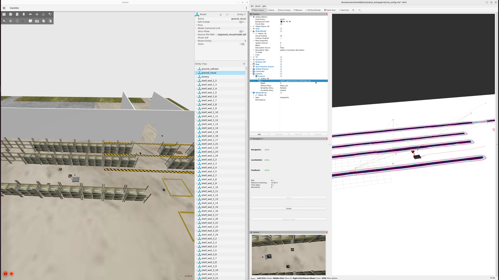

# SIMLAN, Simulation for Indoor Multi-Camera Localization and Navigation (2.0.1)

This simulation environment, based on the Gazebo Ignition simulator and ROS2, resembles a Volvo trucks warehouse and serves as a playground for rapid prototyping and testing indoor multi-camera localization, positioning, and navigation algorithms. While this environment can be utilized for Multi-Sensor SLAM (Simultaneous Localization and Mapping) using cameras, IMUs, GPS, LiDAR, and radar *mounted on the robot*, the focus of this project is *not* on mapping but operating within a *fixed building layout* and using fixed cameras *mounted on the ceiling*. This project is inspired by [GPSS (Generic photo-based sensor system)](https://www.volvogroup.com/en/news-and-media/news/2024/nov/ai-modern-manufacturing.html) that utilizes ceiling mounted cameras, deep learning and computer vision algorithms, and very simple transport robots. \[[GPSS video demo](https://www.youtube.com/watch?v=DA7lKiCdkCc)\]

Please click the YouTube link below to view the SIMLAN demo video:

[](https://www.youtube.com/watch?v=mhA51PPdABc)

## Advantages of Multi-Camera Localization

- Enhanced monitoring and coordination through a comprehensive, real-time overview of the entire environment.
- Robustness to environmental changes, including constantly shifting or visually similar elements (e.g., shelves in warehouses, crops in agricultural settings).
- Independence from GPS and Other On-Board Sensors (indoor environment)
- Simplified Robot Design and Maintenance.
- Eliminates the need for frequent remapping by relying on stable, fixed ceiling-mounted cameras.
- Centralized control and navigation (to avoid deadlock or need for robot communication).
- Use of computer vision techniques that are intuitive and easy for operators to understand, while remaining flexible to integrate additional machine learning–based safety and monitoring algorithms as needed.

## SIMLAN Features

- Ignition Gazebo
- Library of objects
- ROS 2 Interfaces
- Multi-Robot Localization
- Multi-Agent Navigation
- ArUco Marker Localization
- Simple GPSS (Generic photo-based sensor system) implementation
- Real-World Environment Inspired Design (camera position and warehouse layout)
- Bird’s-Eye View Projection
- Multi-Sensor Support (LiDAR, Camera, Semantic segmentation, etc.)

## Dependencies

You can use [these commands (tested on Ubuntu 24.04)](DEPENDENCIES.md) to install  docker and ensure that your linux user account has `docker` access.

*Attention*: Make sure to restart the computer (for the changes in group membership to take effect.) before proceeding to the next step.

## Installation

To improve collaboration in development environment we use vscode and docker as explained in [this instruction](https://www.allisonthackston.com/articles/docker-development.html) using these [docker files](https://github.com/athackst/dockerfiles). For production environment follow installation procedure used in [.devcontainer/Dockerfile](.devcontainer/Dockerfile) to install dependencies.

Install Visual Studio Code (VS Code) and open the project folder. VS Code will prompt you to install the required extension dependencies.
Make sure the `Dev containers` extension is installed. Reopen the project in VS Code, and you will be prompted to rebuild the container. Accept the prompt, this process may take a few minutes.
Once VS Code is connected to Docker (as shown in the image below), open the terminal and run the following commands:


(if you don't see this try to build manually in vscode by pressing `Ctrl + Shift + P` and select `Dev containers: Rebuild and Reopen in container`.
)

## Quick start

On a **host** machine's terminal (**not** inside Visual Studio Code terminal): `xhost +local:docker`.

The best place to learn about the various features, start different components, and understand the project structure is [`./control.sh`](./control.sh).

*Attention*: The following commands (using `./control.sh`) are executed in a separate terminal tab inside _vscode_.

To kill all the relevant process (related to gazebo, ros2), delete build files, delete recorded images and rosbag files using the following command:

```bash
./control.sh clean
```

To clean up and build the ros2 simulation

```bash
./control.sh build
```

It is possible for the cameras to detect aruco markers on the floor and publish their location to TF, both relative to the camera, and the arucos transform from origin. The package [./camera_utility/aruco_localization](./camera_utility/aruco_localization) contain the code for handling aruco detection.

You can also use nav2 to make a robot_agent (that can be either robot/pallet_truck) navigate by itself to a goal position. You can find the code in [simulation/pallet_truck/pallet_truck_navigation](simulation/pallet_truck/pallet_truck_navigation)

**Run these in a separate terminals**

```bash
./control.sh gpss # spawn the simulation, robot_agents and GPSS aruco detection
./control.sh nav  # spawn map server, and separate nav2 stack in a separate namespace for each robot_agent
./control.sh send_goals # send navigation goals to nav2 stack for each robot_agent
```

Finally, to view the bird's-eye perspective from each camera, run the following command and open `rviz` Then, navigate to the `/static_agents/camera_XXX/image_projected` topic to visualize the corresponding camera feed:

```bash
./control.sh birdeye
```

## Advanced options

See [ISSUES.md](ISSUES.md) to learn about additional advanced options and to check known issues before reporting any issue or requesting new features. To start the project **without NVIDIA GPU** please comment out these lines in `docker-compose.yaml` as shown below:

```bash
  #   runtime: nvidia
  #
  # factory_simulation_nvidia:
  #  <<: *research-base
  #  container_name: factory_simulation_nvidia
  #  runtime: nvidia
  #  deploy:
  #    resources:
  #      reservations:
  #        devices:
  #          - driver: nvidia
  #            count: "all"
  #            capabilities: [compute,utility,graphics,display]
```

`camera_enabled_ids` specifies which cameras are enabled in the scene for aruco code detection and birdeye view.

To run ros2 commands in the same DOMAIN:

```
./control.sh cmd ros2 run  tf2_tools view_frames
```

### Gazebo Classic

Gazebo Classic (Gazebo11) has reached end-of-life (EOL). An earlier version of this repository, which uses Gazebo Classic, can be found in the [gz_classic_humble branch](https://github.com/infotiv-research/SIMLAN/tree/gz_classic_humble).

## Documentation

Learn more about the project by reading these documents:

- [Control script as a shortcut to run different scripts](control.sh) :
- [Simulation and Warehouse Specification](simulation/README.md)
- [Building Gazebo models (Blender/Phobos)](simulation/raw_models/README.md)
- [Objects Specifications](simulation/raw_models/objects/README.md)
- [Warehouse Specification](simulation/raw_models/warehouse/README.md)
- [Aruco Localization Documentation](simulation/aruco_localization/README.md)
- [Palelt Truck Navigation Documentation](simulation/pallet_truck/pallet_truck_navigation/README.md)
- [Camera positioning (Extrinsic/Intrinsic calibrations)](camera_utility/)
- [`CHANGELOG.md`](CHANGELOG.md)
- [`CREDITS.md`](CREDITS.md)
- [`LICENSE`](LICENSE)

## Research Funding

This work was carried out within these research projects:

- The [SMILE IV](https://www.vinnova.se/p/smile-iv/) project financed by Vinnova, FFI, Fordonsstrategisk forskning och innovation under the grant number 2023-00789.
- The EUREKA [ITEA4](https://www.vinnova.se/p/artwork---the-smart-and-connected-worker/) ArtWork - The smart and connected worker financed by Vinnova under the grant number 2023-00970.
