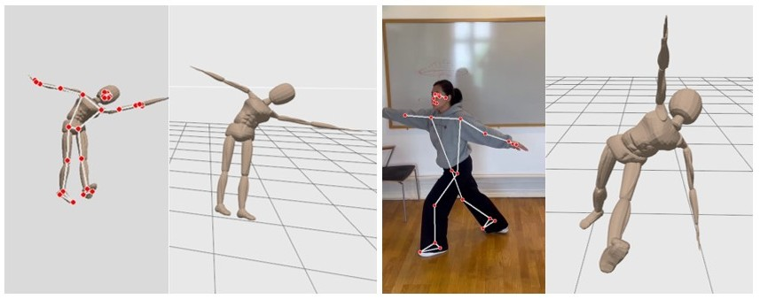
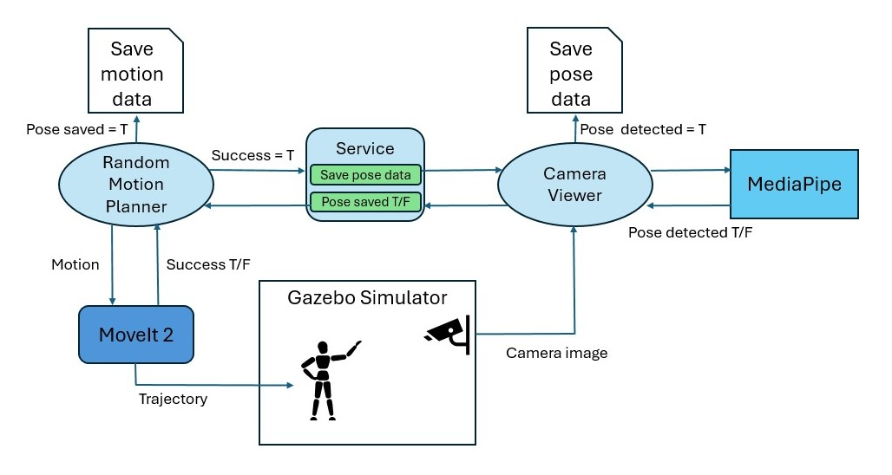
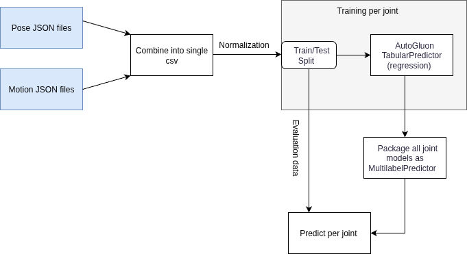
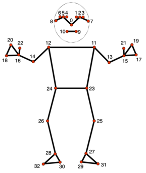
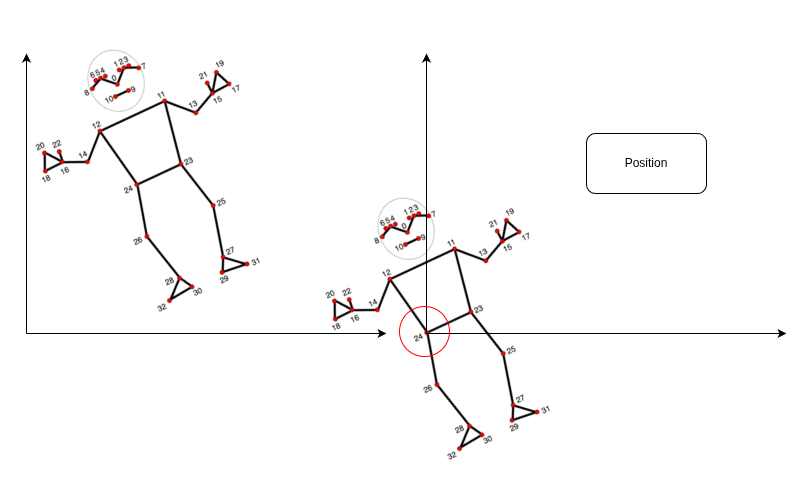

# Humanoid Motion Capture

This project develops a system for translating human pose detection to humanoid robot motion in simulation environments. Using Google MediaPipe for pose landmark detection from camera input, the system maps detected human poses to corresponding joint movements executed by a humanoid robot in Gazebo simulator. The implementation leverages ROS2 Ignition and MoveIt2 for motion planning and control, with a data generation pipeline that creates training pairs of pose landmarks and robot joint configurations. This approach provides a foundation for safety monitoring applications in industrial simulation (SIMLAN), where human pose analysis can be integrated for workplace incident detection. The work is based on master thesis "Human Motion Replay on a Simulated Humanoid Robot Using Pose Estimation" by Tove Casparsson and Siyu Yi, Supervised by Hamid Ebadi, June 2025.

## Terminology:

- **Forward Kinematics (FK)**: The process of calculating the position and orientation of a robot's links given the values of its joint parameters (e.g., angles or displacements). In other words, FK answers the question: "Where is the robot's hand if I know all the joint values? (usually have one answer)"
- **Inverse Kinematics (IK)**: The process of determining the joint parameters (e.g., angles or displacements) required to achieve a desired position and orientation of the robot's links. In other words, IK answers the question: "What joint values will place the robot’s hand here? (usually have many answers)"
- **Pose** : 3D pose landmarks (MediaPipe) extracted by Mediapipe from an 2D image of human posture
- **Motion** : A kinematic instruction (joint parameters) sent to the robot (via MoveIt) for execution. While "kinematic instruction" would be a more accurate term, we continue to use "motion" for historical reasons (used in the word motion-capture), even though , "motion" often refers to the difference/movement between two postures (e.g., posture2 - posture1).
- **Motion Capture**: Here it means using 2D images to find the motion(kinematic instruction/joint parameters) to instruct a humanoid robot to mimic the human posture.

## The idea

- `I` : an image. (`I_s`: from simulator, `I_r` from real world)
- `P` : a pose (mediapipe output)
- `M` : a motion (moveit2)

then
- `SIM(M) -> I` : Simulator(gazebo) using inverse kinematics(moveit2) to convert the motion `M` to create image `I`
- `PE(I) -> P` : Pose estimator(mediapipe) takes the image `I`, to find human pose `P`
- `Q(P) -> M` : machine learning model `Q`, takes pose `P` and tries to replicate that pose estimator(mediapipe) pose using motion (moveit) `M`

Assumption: Pose estimator(mediapipe) performs good enough that it can detect human poses from both simulator and real-world domains:
- `PE(I_r) -> P_r`
- `PE(I_s) -> P_s`

Our goal is to
- pass random M to build the dataset of pairs :  `<M,PE(SIM(M))> = <M,P>` 
- Use the dataset above to find `Q()` which is the inverse of this `PE(SIM())`

No we can do motion capture (replicate real human movements) by `Q(PE(I_r))` 

## Dataset creation
The below image describes how the dataset generation system works.

# Overview

The diagram below shows the overall workflow of this project. Pose and motion data are first collected from JSON files and combined into a single CSV file. Each robot joint is trained separately using AutoGluon TabularPredictor (regression). All joint models are then packaged together as a MultilabelPredictor, which is used to predict robot motion from new pose inputs.

# Dataset

Each row in the CSV file represents one pose sample and its corresponding robot motion from a specific camera.
- The first two columns are metadata: `motion_id` (unique identifier for the motion) and `camera_id` (which camera captured the pose)
- The next columns are the 3D coordinates (x, y, z) for each of the 33 MediaPipe pose landmarks and for each camera, named like `cam500_0_x, cam501_0_x, cam502_0_x, cam503_0_x, cam500_0_y, cam501_0_y, cam502_0_y, cam503_0_y, cam500_0_z, cam501_0_z, cam502_0_z, cam503_0_z...`.
- The remaining columns are the robot joint positions (motion targets) for that sample, with names like `jRightShoulder_rotx`, `jLeftElbow_roty`, etc.
- In order to switch from (p1,p2,p3,p4,m) data structure to (p1,m) ...(p4,m), we need to normalize it (position, scale, rotation)

### Notes
- It is a "feature" (not a bug) that some cameras cannot detect the pose (NaN values). It helps to be still able to detect pose when a part of body is masked.
- Mediapipe cannot reliable detect the depth, back and front
- Experiment different options for NaN values (average of other rows, zero, etc)

# Preprocessing

https://ai.google.dev/edge/mediapipe/solutions/vision/pose_landmarker

Three steps of normalization (feature engineer) of mediapipe landmarks:
- Position normalization
- Scale normalization
- Rotation normalization

## Translation of a detected pose to humanoid motion command​

This project employs a deep neural network to learn the mapping between human pose and humanoid robot motion. The model takes 33 MediaPipe pose landmarks as input and predicts corresponding robot joint positions.

## Neural network design

- Input Layer: 33 MediaPipe pose landmarks for each camera (x, y, z coordinates)
- Hidden Layers: Multi-layer perceptron with pose normalization preprocessing
- Output Layer: Robot joint position sequences for humanoid motion control
- Training: Supervised learning on pose-motion paired datasets

## Project Structure:
- [`input/`](input) : This folder has the pose data to be predicted
- [`output/`](output) : This folder saves the predicted motion data and intermediate results
- [`models/`](models) : This folder save the `pose_motion_model.pth`, loss plots and training params
- [`/DATASET/TRAIN`](DATASET): Contains motion, pose and image files generated by `./control.sh dataset TRAIN`
  - `motion_data` : Corresponding random motion (request)
  - `camera/pose_data` : Mediapipe pose (result) for each camera
  - `camera/pose_images`: Mediapipe annotated images and original images for each camera
- [`/DATASET/EVAL`](DATASET): Contains motion, pose and image files generated by `./control.sh dataset EVAL`
  - `motion_data` : Corresponding random motion (request)
  - `camera/pose_data` : Mediapipe pose (result) for each camera
  - `camera/pose_images`: Mediapipe annotated images and original images for each camera
- [`pose_to_motion/`](pose_to_motion): Contains the ML training pipeline for pose-to-motion prediction
  - [`mp_detection.py`](mp_detection.py): Handles pose detection from actual images or videos using MediaPipe

## Issues and future works

- It seems that MediaPipe is not capable of detecting the front and back (therefore correctly detect the left and right side of the body)