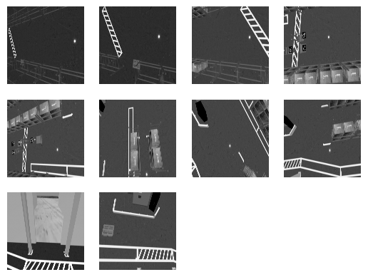
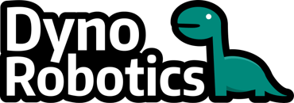

---

false
marp: true
theme: default
size: 4K
paginate: false
#footer: 'Hamid Ebadi'
#header: '[▣](#1 " ")    SIMLAN Project'

# SIMLAN open-source project

---

# Open-Source Simulation for Multi-Camera Robotics

<!-- Contribute, Collaborate and Create​ -->

## The SIMLAN Framework

**Hamid Ebadi**, senior researcher at *Infotiv AB*

<!--
Use MARP to see these slides [https://marp.app/](https://marp.app/)
-->

---

# Research Projects

- **SMILE-IV**: safety assurance framework for **transport services**

- **ARTWORK**: The **smart** and **connected worker**

<!--
- **SMILE-IV**: Developing technologies and a **safety assurance framework** for transport services using small autonomous vehicles.
- **ARTWORK**: The **smart** and **connected worker** project, the goal is to create a real-time, context-aware assistance system for workers.
- Infotiv supports other partners with their research projects
-->

---

# Volvo Projects

Volvo GTO in Tuve, Göteborg:

- **RITA** (Robot In The Air): collaborative robot designed to assist with kitting

- **GPSS** (Generic Photogrammetry-based Sensor System): **ceiling-mounted cameras** <!-- guiding transport robots to their destinations These cameras --> act as the **shared "eyes"** of the robot fleet.
  **(more later)**

---

# Autonomous Robotics (intro)

---

# Autonomous Robotics

## SLAM

- Vacuum cleaner
- Simultaneous localization and mapping
- Reliance on onboard sensors
- Distributed decision making
- Communication and synchronization

<!--
- [SLAM](https://en.wikipedia.org/wiki/Simultaneous_localization_and_mapping): constructing (or updating) a map of an unknown environment while simultaneously keeping track of an agent's location within it usually using  [Lidar](https://www.youtube.com/watch?v=ZAESH7bu3IY) or [Camera](https://youtu.be/9cPqbtiGWKM?feature=shared&t=16).
-->

---

# Autonomous Robotics

- Limited field of view
- Sensor interference (LiDAR)
- No global view
  - resolving right-of-way
  - avoiding gridlock
- Handling challenging environments
  - no landmarks
  - repetitive landmarks
  - dynamic landmarks

---

[Watch the Video](https://youtu.be/DA7lKiCdkCc?t=122)

---

# Centralised Robotics (pros)

- GPSS (camera-based)
- Simpler onboard computation
- Focus on control
- Energy consumption
- Simpler hardware
- Easier to maintain and upgrade
- No robot-to-robot communication

---

# Centralised Robotics (pros)

- Improved explainability and accountability
- Camera is used for safety monitoring and repudiation.
- Improving the safety by using both onboard and offboard sensors
- More flexible to add ML based models

---

# Centralised Robotics (cons)

- Real-time needs and latency
- Centralised processing and a single point of failure
- No mapping but only localization using fixed cameras

---

# Continuously testing these ML systems is challenging.

---

# Open-Source Simulation for Multi-Camera Robotics

## The SIMLAN Framework

- Using simulation for complex human-robot collaboration.
- Inspired by Volvo Group’s GPSS/RITA
- Models ceiling-mounted cameras + factory layouts

---

# SIMLAN: Asset & Environment Modeling (1)

- Realistic warehouse models
- Free/Open-source 3D software: FreeCAD, Blender
- Relevant Assets:
  - shelves
  - pallets
  - boxes, ...
- Configurable physical properties:
  - collision, inertia, mass, dimensions, visuals

---

# SIMLAN: Asset & Environment Modeling (2)

- **Sensors**:
  - camera
  - semantic segmentation
  - depth sensors
  - collision sensors
- **Static Elements**:
  - layouts
  - camera coordination and orientation
  - ArUco markers on agents

---

[DEMO: SIMLAN physics failures](https://youtu.be/wXyfRg-_eic)

---

# SIMLAN: Asset & Environment Modeling (3)

- **Dynamic Elements**:

  - Pallet truck
  - Forklift
  - Human worker
  - Robotic Arm

---

# Multi-Agent & Namespace Support & DOMAIN ID

- Unique **namespace + ArUco ID**
- Spawning static & dynamic agents
- Localisation and Navigation

---

# Camera Configuration/Calibration

- **Intrinsics**: focal lengths, principal point, distortion coeffs
- **Extrinsics**: rotation matrix + translation vector
- enables precise **world-to-pixel projection**
- crucial for image stitching & ArUco localization

---

# Bird’s-Eye View & Image stitching

- transform world → camera → pixel coordinates
- enables stitching of multiple camera feeds
- `camera_bird_eye_view` package
  

---

# ArUco Localization

- proof-of-concept GPSS system in SIMLAN

- uses OpenCV ArUco markers for localization

- `aruco_localization` package

---

# ArUco Navigation

- Input: `tf2` (positions)
- `Nav2` navigates (with a lot of wiring)
- multi-camera robustness

---

# Safety

"Behavior Tree" for Geo-fencing

- loss of observability
- restricted area
- collision

---

[SIMLAN GPSS video demo](https://youtu.be/mhA51PPdABc?si=aGnCkyvzAF7rpz8v&t=108)

---

# RITA (Robot In The Air): collaborative robot designed to assist with kitting

---

---

[Panda arm demo](https://www.youtube.com/watch?v=3yCLIu5GAn8)
[Panda arm and humanoid demo](https://www.youtube.com/watch?v=EiCNiPeifPk)

---

# Gazebo Actors

- Gazebo actors: skeleton animation from COLLADA or BVH files and scripted trajectories
- Gazebo actors are static (scripted trajectories only) and cannot interact physically.
- This limits their behavior to what they are strictly scripted for

---

# Humanoid Motion Capture

Humanoid robots replicate a real worker's movements.

- Google MediaPipe pose estimation (landmarks)
- Neural Network translates landmarks to joint controls.
- MoveIt2 handles motion planning and execution of the humanoid in Gazebo.

---

[Humanoid training](https://www.youtube.com/watch?v=iNW2jYUsv9c)

---

# Summary of SIMLAN Features

- Dockerized dev environment
- Lower barriers for research in robotics/ML
- Features:
  - Bird’s-eye stitching
  - ArUco-based localization
  - ROS 2 / Nav2 integration
  - Panda arm and humanoid

---

# SIMLAN Use Cases

- **Rapid prototyping** of ML-based localization/navigation
- **Reproducible experiments** : consistent testing
- **Synthetic data generation** for ML models
- **Safety testing** without risking physical assets
- **High level of interaction** reinforcement learning & genetic algorithm experimentation
- **CI/CD** : continuous development
- **V&V** to support verification and validation of complex, machine learning-based systems

---

# SIMLAN Use Cases

Testing and Development

- Cost-efficient
- Fast
- Scalable
- Safe
- Privacy-friendly
- Reproducible (CI/CD)

---

# Open source

- Apache 2.0 license
- SIMLAN: [https://github.com/infotiv-research/SIMLAN](https://github.com/infotiv-research/SIMLAN)
- Infotiv portfolio of projects (academic papers):
- [https://infotiv-research.github.io/](https://infotiv-research.github.io/)

---

# Technical Highlights

- **Middleware**: ROS2 (Robot Operating System) - Jazzy Jalisco
  - standard interfaces
- **Simulation Engine**: Ignition Gazebo, simulating
  - Physics
  - Sensor
- **Developer environment**: Docker + VS Code devcontainers (consistency and reproducibility)
- **Documentation**: extensive & reproducible

---

# Testing or Development

- Simulation is for testing ONLY?
- Pushing simulation toward the entire Software Development Life Cycle (SDLC)

---

---

[Demo 1](https://github.com/user-attachments/assets/4c1da01f-c3fd-4b6c-b084-f5ef653abb80) , [Demo 2](https://github.com/user-attachments/assets/169cf5c5-de59-44db-b1bf-19fb57cb7e2e)

---

# Future Work

## Generative AI

- Style transfer w/ GANs for higher visual fidelity
- Forward diffusion process
- Reverse diffusion process
- Hallucination
- Integrate **World Foundation Models** (e.g., NVIDIA Cosmos)

---

---

# Conclusion

- **SIMLAN**: powerful platform for indoor multi-camera robotics
- Reproducible, scalable, open-source
- Academia & Industry
- Roadmap: ML integration, human-robot collaboration, sim-to-real transfer
- Need your support

---

## Acknowledgements

- INFOTIV AB
- SMILE IV (Vinnova grant 2023-00789)
- EUREKA ITEA4 ArtWork (Vinnova grant 2023-00970)
- **INFOTIV Colleagues**:  Pär Aronsson, Anton Hill, David Espedalen, Siyu Yi,  Anders Bäckelie, Jacob Rohdin, Vasiliki Kostara, Nazeeh Alhosary, Marwa Naili
- **Other contributors**: Tove Casparsson, Filip Melberg (Chalmers), Christoffer Johannesson, Sebastian Olsson, Hjalmar Ruscck from Dyno-robotics,  Erik Brorsson (Chalmers/Volvo), **<placeholder for your name>**
- **Other Partners**: Infotiv AB, RISE, Volvo Group, Dyno-Robotics, Chalmers

---

| INFOTIV AB                            | Dyno-robotics                          | RISE Research Institutes of Sweden | CHALMERS                               | Volvo Group                    |
| ------------------------------------- | -------------------------------------- | ---------------------------------- | -------------------------------------- | ------------------------------ |
|  |  |  |  |  |

---

- [https://infotiv-research.github.io](https://infotiv-research.github.io)
- [https://github.com/infotiv-research/SIMLAN](https://github.com/infotiv-research/SIMLAN)
