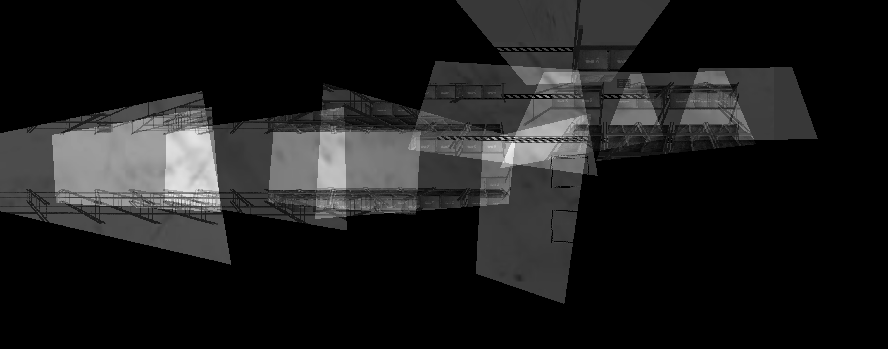
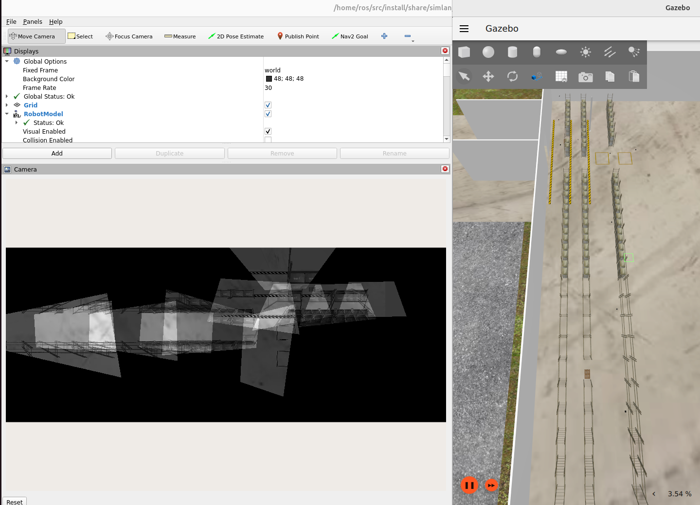

# bird-eye-view package

This package aims to contain projection functionality which originates from [projection.ipynb](../../camera_utility/projection.ipynb) notebook.

This package features being able to select areas of your choosing and create a bird-eye-view of that area by using available cameras, viewing that area. 

Command to run birdeye launch file:
```bash
./control.sh birdeye
```

Screenshots:


