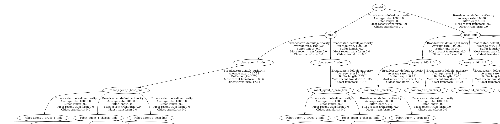

### Map server

Instead of starting with an empty map, to get the general layout of the environment and detect the static object in the environment (walls, cooridors and hallways) you can **optionally** build a map.
To start mapping (otherwise known as cartography), you can use `cartography.launch.py`. It requires a lidar to be mounted on the `robot_agent` and `odometry` to exist, which can be activated from the  `camera_utility/aruco_localization` package. 

Launch the following package, run gazebo, rviz, aruco_localization, and start moving around the simulation with the robot_agent. When you are finished you need to save it using this command: `ros2 run nav2_map_server map_saver_cli -f simulation/pallet_truck/pallet_truck_navigation/maps/YOUR_MAP_NAME`. Keep in mind that this step needs to be done only once and the map assumed to be static.

We only have one map for all navigation stack. This simplify making obstacle and other robot agent to all other robot agents.

```
Node(  # Manually setting the joint between map and odom to 0 0 0, i.e. identical to each other. map -> odom
  package="tf2_ros",
  executable="static_transform_publisher",
  name="static_world_to_map",
  arguments=["0", "0", "0", "0", "0", "0", "world", "map"],
  ...
```

### Robot_agent Launch

For each robot you need to define its initial position, its assigned aruco code and more importantly its unique **namespace** in `multiple_robot_spawn.launch.py`:
```
{
  "namespace": "robot_agent_1", 
  "initial_pose_x":"10.0", 
  "initial_pose_y":"1.0", 
  "robot_type":"pallet_truck", 
  "aruco_id":"1"
},
```

### Robot_agent navigation

This package covers the functionality of mapping, localizing, and navigation for the robot_agent. Each package is built using code from the nav2 packages, thus you are able to modify the launch files but to change the node's behaviour you need to modify the config files. The code is tailored for the robot_agent and using the `aruco_detection` package that supplies `/TF` chain for the truck.

- The `aruco_localization` package runs the aruco localisation.
- The `nav2.launch.py` uses the localisation (from the previous step) for the  navigation of the robot_agent.

Keep in mind that the same namespace has to be used when launching the navigation stack:  `ros2 launch pallet_truck_navigation nav2.launch.py namespace:=robot_agent_1`

For navigation to be able to automatically find the robot agent, we have to set a namespace that specified when launching the robot_agent. (see above)

Each robot has it own navigation configuration in `robot_agent_X_nav2_params.yaml`. We use following `/TF` structure:




**Note** that `world`, `map` and `robot_agent_X/odom` are static at the same position and the actual position is determined by `robot_agent_X/base_link`.

Good video to watch for multi agent navigation: https://www.youtube.com/watch?v=cGUueuIAFgw

## Obstacles detection (update_map_node)
We have static object in the map and initially we had updated that single map with dynamic obstacles (Robot_agents). The problem with this single map was that nav2 navigation stack of robot_agent_1 sees itself within the obstacle created for robot_agent_1 (**itself**). Therefore it is decided that each robot_agent has its own map that has everything except itself.  So this is a node to create a map with obstacles around all **other** existing robot_agents in the simulation. Each robot is assigned a map_server and this node send an updated map with all other robots_agents as obstacle to the correct namespaced map_server.

The node is launched in `src/simulation/pallet_truck/pallet_truck_navigation/launch/nav2.launch.py`

---

The `/map_updater/update_map_node.py` node works as following:

First it makes a copy of the `warehouse.pgm` map which is a long array of pixel values ranging from (0-255) and saves it as `original_array`. Since the map nav2 needs has a different setup than the `.pgm` file, a conversion is needed.

The .pgm file has these pixels ranges

|value  |meaning                                  |
|-----  |-----------------------                  |
|0      |black obstacle                           |
|255    |White Free space                         |
|1-254  |ranges of gray, not defined at the moment|


The map nav2 needs is set up with pixels ranging from (-1-100) where

|value|meaning                |
|-----|-----------------------|
|-1   |Unknown                |
|0    |Free space             |
|100  |obstacle               |
|1-99 |probabilistic occupancy|

therefore this has to be parsed to match by doing the following:

```python
current_array = self.original_array.copy()
occupancy_array = np.zeros(current_array.shape, dtype=np.uint8)
occupancy_array[current_array.copy()<100] = 100
```

So everything that is supposed to be a wall in the .pgm file is parsed as a wall in the map context

The map is a 2D array, typically stored row-major from bottom-left, but many implementations flip it vertically ([::-1]) to match how image viewers treat top-left as (0,0). and therefore the following is done

``` python
occupancy_array = occupancy_array[::-1, :]
```

Then the position of all other robot_agents are found by their transforms and an obstacle is set at their position which is updated with 10Hz to continuously update their positions.

This concept is repeated for all namespaces sent through the ./control.sh nav function.

---

### Issues and future work

TODO: Clarify these

**How often the new path the pallet_trucks can take be update**
add a speed limiter instead of obstacle, in those cases the robot will slow down instead of replanning and avoiding completely update slower could probably mix with the inflation radius's of the costmaps to make robot take wider turns

**Collision**
Two robots that are approaching each other (from left and right) don't know where each one is planning to go and they can make the decision to pick the path on top lane instead of one going above and one from bottom.

Possible solution: block future path on every other robots map!


