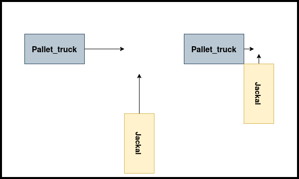
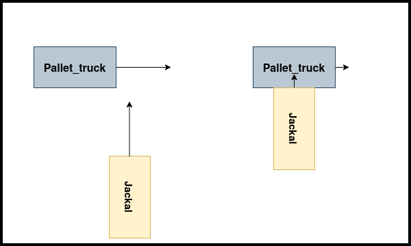
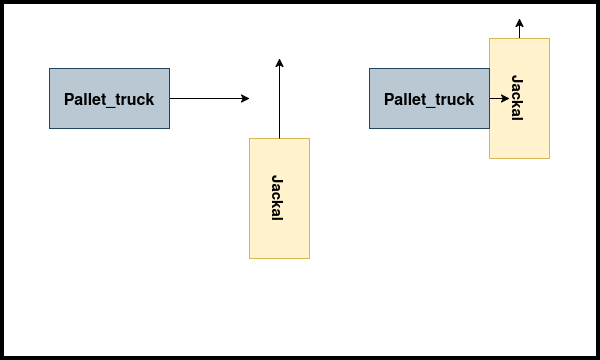

# 🚀 Scenario Manager

## 📌 Overview
The `scenario_manager` package is a ROS2 package designed to manage and execute various robot scenarios involving teleportation, speed setting, and collision simulations. It provides action servers to control robot behavior and a tool for calculating Time to Collision (TTC).

## 🚦 Launching the Scenario Manager
To start the `scenario_manager`, launch it using the following command:

```bash
ros2 launch scenario_manager scenario_manager.launch.py
```

This initializes three action servers:
- **🚀 teleport_action_server**: Handles teleportation of robots.
- **⚡ set_speed_action_server**: Controls robot speed.
- **💥 collision_action_server**: Configures scenarios where robots collide (only applicable to `jackal` and `pallet_truck`).

## 🔄 Collision Action Server
The **collision_action_server** configures collisions by setting speeds and initial positions for two robots to ensure a collision occurs. It requires:
- **📐 Angle**: The approach angle.
- **🏎️ Speed of pallet_truck**: The movement speed of the pallet truck.
- **💠 Collision Type**: An enum from the `simlan_custom_msg` package specifying the type of collision.

### 💥 Collision Types
There are three predefined collision types:

| Collision Type | Enum Value | Description |
|--------------|-----------|-------------|
| HEAD_ON | `0` | Robots collide head-on. |
| PALLET_TRUCK_SIDE | `1` | Pallet truck collides into the side of Jackal. |
| JACKAL_SIDE | `2` | Jackal collides into the side of the pallet truck. |

Below are images illustrating the different collision types:

<p align="center">
  
  
  
</p>
<p align="center">
  <b>Left: Head-On Collision | Middle: Pallet Truck Side Collision | Right: Jackal Side Collision</b>
</p>

## 🎬 Running a Scenario
To execute a scenario, use the following command:

```bash
ros2 launch scenario_execution_ros scenario_launch.py scenario:=<scenario_file>
```

Replace `<scenario_file>` with a specific scenario file, such as:

```bash
ros2 launch scenario_execution_ros scenario_launch.py scenario:=simulation/scenario_manager/scenarios/case1.osc
```

This runs a collision action client, executing multiple collision simulations with varying angles and speeds.

## ⏳ Time to Collision (TTC) Calculation
The package includes a **TTC node** that logs the **Time to Collision (TTC)** and **Closest Point of Arrival (CPA)** for two robots assuming constant speed and direction.

### ▶️ Running the TTC Node

```bash
ros2 run scenario_manager ttc
```

This node calculates and logs:
- **⏱️ TTC**: The time at which the closest approach occurs.
- **📍 CPA**: The closest distance between the two robots assuming constant speed and trajectory.

📌 *Note:* As of version **1.0.6 (February 2025)**, the TTC node logs data but does not publish it elsewhere.
